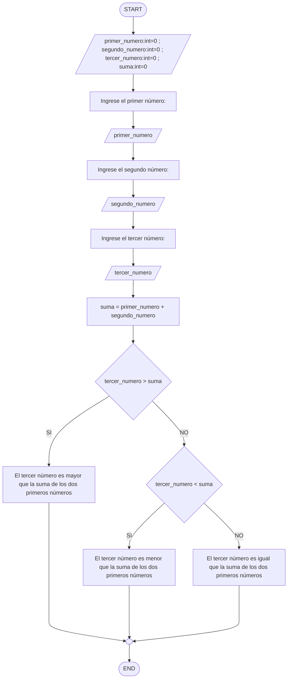

# Taller #1
### Fecha:  13-09-2023
### **Nombre del equipo:** Fotocopiadoras Industriales
  **Integrantes del equipo:** María Alejandra Niño Peña y María Alejandra Varela
### **Logo:** (FALTA)
### 1. El resultado de nuestro Python Beginner Quiz:


### 2. Realice un programa que lea tres números reales y determine cuál es el mayor.
* Para este punto debíamos realizar un programa que leyera tres números reales y determinara cuál es el mayor.
  Primero declaramos que las variables que ingresara el usuario debian ser números reales (float), y posteriormente con una estructura if-elif comparamos cada una de las variables para determinar la mayor.
* Ver documento:
Quien_es_mas_grandecito.py
```pseudocode
print("-------------------------------------------------------")
print("Determinar cual número es mayor")
print("-------------------------------------------------------")
#Entradas
print("Ingrese tres números reales: ")
a=float( input("a: "))
b=float( input("b: "))
c=float( input("c: "))
#Proceso
if a > b and a > c:
  print("El número mayor es:")
  print(a) 
elif b > a and b > c:
  print("El número mayor es:")
  print(b)
elif c > a and c > b:
 print("El número mayor es:")
 print(c)
```
### 3. Enunciado: Realice un programa que lea un número enteros y determine si es par o impar.
* En este programa debíamos determinar si un número ingresado por el usuario era par o impar.
  Primero determinamos cúales serían nuestras variables y de que tipo serían (n : int = 0)
  Despues para determinar si es par, haciendo uso de un condicional, calculamos si el residuo de este número dividido entre 2 era 0, ya que todo número par es divisible por 2 este debería ser su resultado si resulta ser afirmativo.
  De no ser así, significa que el número ingresado es impar.
* Ver documento: Punto_3.ipynb
```pseudocode
print("-------------------------------------------------------")
print("Determinar si el número entero es par o impar")
print("-------------------------------------------------------")
#Entradas
n: int = 0
print("Ingrese un número: ")
n=int( input("n: "))
#Proceso
if n%2==0:
  print("El número ingresado es par")
else:
  print("El número ingresado es impar")
```
### 4. Enunciado: Realice un programa que lea dos números reales y determine si el primero es múltiplo del segundo.
* Para este punto debíamos hacer un programa que leyera dos números reales y determinara si el primero era múltiplo del segundo.
  Como en el punto #2 lo primero que hicimos fue declarar que los números que ingresara el usuario debían ser reales (float), depués con una estructura if-else condicionamos con un operador de asignacion con residuo igualado a cero.
* Ver documeto:
  Amigo_o_enemigo.py
```pseudocode
print("-------------------------------------------------------")
print("Determinar cual número es mayor")
print("-------------------------------------------------------")
#Entradas
print("Ingrese dos números reales: ")
a=float( input("a: "))
b=float( input("b: "))
#Proceso
if a % b == 0:
    print(f"{a} Es múltiplo de {b}")
else:
    print(f"{a} No es múltiplo de {b}")
```
### 5. Enunciado: Realice un programa que lea tres números reales y determine si la suma de los dos primeros es mayor, menor o igual que el tercer número.
* En este programa se debe determinar si la suma total de dos números ingresados es mayor, menor o igual que un tercer número.
  Primero, determinamos cuáles serían nuestras variables y realizamos un código para que el usuario ingresara tres números.
  Después, realizamos la suma de los dos primeros números ingresados y, para determinar su relación con respecto al tercer número, mediante el uso de condicionales; igualamos, utilizamos el signo de mayor que, y el signo de menor que. Para el enunciado con que la suma resulte verdadera, el programa mostrará con cuál de estos casos se relaciona.
* Ver documento: Punto_5.ipynb
* Diagrama de flujo:

* Código:
```pseudocode
print("-------------------------------------------------------")
print("Determinar si la suma de los dos primeros números es mayor, menor o igual que un tercer número")
print("-------------------------------------------------------")
#Entradas
primer_numero: int = 0
segundo_numero: int = 0
tercer_numero: int = 0
suma: int = 0
print("Ingrese el primer número: ")
primer_numero=int( input("primer_numero: "))
print("Ingrese el segundo número: ")
segundo_numero=int( input("segundo_numero: "))
print("Ingrese el segundo número: ")
tercer_numero=int( input("tercer_numero: "))
#Proceso
suma=primer_numero+segundo_numero
if tercer_numero>suma:
  print("El tercer número es mayor que la suma de los dos primeros números ")
elif tercer_numero<suma:
  print("El tercer número es menor que la suma de los dos primeros números ")
else:
  print("El tercer número es igual que la suma de los dos primeros números")
```
### 6. Enunciado: Escriba un programa que solicite al usuario una letra y determine si es una vocal o una consonante.
* En este punto nuestro objetivo debía ser escribir un programa que solicitara al usuario una letra y determinara si era una vocal o una consonante.
  Con una estructura if-else y utilizando el conector or, definimos las vocales y las letras. (Tambien tuvimos en cuenta las mayúsculas, por eso se ve larguísimo :))
* Ver documento: Sonidos_y_maneras.py
* Diagrama de flujo:
```mermaid
(DIAGRAMA)
```
* Código:
```pseudocode
print("-------------------------------------------------------")
print("Determinar si una letra es vocal o consonante")
print("-------------------------------------------------------")
#Entradas
n=( input("Escriba una letra: "))
#Proceso
if n == "a" or n == "e" or n == "i" or n == "o" or n == "u" or n == "E" or n == "I" or n == "O" or n == "U" or n == "A":
    print(f"{n} Es una vocal")
elif n == "q" or n == "w"  or n == "r" or n == "t" or n == "y" or n == "p" or n == "s" or n == "d" or n == "f" or n == "g"or n == "h"or n == "j"or n == "k"or n == "l"or n == "z"or n == "x"or n == "c"or n == "v"or n == "b"or n == "n"or n == "m" or n == "Q" or n == "W"  or n == "R" or n == "T" or n == "Y" or n == "P" or n == "S" or n == "D" or n == "F" or n == "G"or n == "H"or n == "J"or n == "K"or n == "L"or n == "Z"or n == "X"or n == "C"or n == "V"or n == "B"or n == "N"or n == "M":
    print(f"{n} Es una consonante")
```
### 7. Enunciado: Escriba un programa que pida 5 números reales y calcule las siguientes operaciones:
- El promedio
- La mediana
- El promedio multiplicativo (multilplica todos y luego calcula la raíz de la cantidad de operandos)
- Ordenar los números de forma ascendente
- Ordenar los números de forma descendente
- La potencia del mayor número elevado al menor número
- La raíz cúbica del menor número
* Puedes ver la explicación de este ejercicio en el siguiente link: (SUBIR LINK DE YOUTUBE)
* Ver documento: Quita_sueños_3000.ipynb
```pseudocode
print("-------------------------------------------------------")
print("Calcular el promedio, mediana, promedio multiplicativo, ordenar los números de manera ascendente y descendente, potencia del mayor número y raíz cúbica menor número")
print("-------------------------------------------------------")
#Entradas
a: float = 0.0
b: float = 0.0
c: float = 0.0
d: float = 0.0
e: float = 0.0
promedio: float = 0.0
multiplicacion: float = 0.0
raiz: float = 0.0
mayor: float = 0.0
menor: float = 0.0
potencia: float = 0.0
cubica_a: float = 0.0
cubica_b: float = 0.0
cubica_c: float = 0.0
cubica_d: float = 0.0
cubica_e: float = 0.0
print("Ingresa cinco números: ")
a=float( input("a: "))
b=float( input("b: "))
c=float( input("c: "))
d=float( input("d: "))
e=float( input("e: "))

#Proceso promedio
print("-------------------------------------------------------")
promedio=(a+b+c+d+e)/5
print(f"Promedio = {promedio}")
print("-------------------------------------------------------")

#Proceso mediana
print("-------------------------------------------------------")
print("Esta es la mediana:")
#"a" es la mediana
if c > d > a > b > e or c > d > a > e > b or c > e > a > d > b or c > e > a > b > d or c > b > a > d > e or c > b > a > e > d or d > c > a > b > e or d > c > a > e > b or d > e > a > c > b or d > e > a > b > c or d > b > a > c > e or d > b > a > e > c or e > c > a > b > d or e > c > a > d > b or e > d > a > c > b or e > d > a > b > c or c > d > a > b > e or c > d > a > e > b or c > e > a > d > b or c > e > a > b > d or c > b > a > d > e or c > b > a > e > d or d > c > a > b > e or d > c > a > e > b:
    print(a)
#"b" es la mediana
if a > c > b > d > e or a > c > b > e > d or a > d > b > c > e or a > d > b > e > c or a > e > b > c > d or a > e > b > d > c or c > a > b > d > e or c > a > b > e > d or c > d > b > a > e or c > d > b > e > a or c > e > b > a > d or c > e > b > d > a or d > a > b > c > e or d > a > b > e > c or d > c > b > a > e or d > c > b > e > a or d > e > b > a > c or d > e > b > c > a or e > a > b > c > d or e > a > b > d > c or e > c > b > a > d or e > c > b > d > a or e > d > b > a > c or e > d > b > c > a:
    print(b)
#"c" es la mediana
if a > b > c > d > e or a > b > c > e > d or a > d > c > b > e or a > d > c > e > b or a > e > c > b > d or a > e > c > d > b or b > a > c > d > e or b > a > c > e > d or b > d > c > a > e or b > d > c > e > a or b > e > c > a > d or b > e > c > d > a or d > a > c > b > e or d > a > c > e > b or d > b > c > a > e or d > b > c > e > a or d > e > c > a > b or d > e > c > b > a or e > a > c > b > d or e > a > c > d > b or e > b > c > a > d or e > b > c > d > a or e > d > c > a > b or e > d > c > b > a:
    print(c)
#"d" es la mediana
if a > b > d > c > e or a > b > d > e > c or a > c > d > b > e or a > c > d > e > b or a > e > d > b > c or a > e > d > c > b or b > a > d > c > e or b > a > d > e > c or b > c > d > a > e or b > c > d > e > a or b > e > d > a > c or b > e > d > c > a or c > a > d > b > e or c > a > d > e > b or c > b > d > a > e or c > b > d > e > a or c > e > d > a > b or c > e > d > b > a or e > a > d > b > c or e > a > d > c > b or e > b > d > a > c or e > b > d > c > a or e > c > d > a > b or e > c > d > b > a:
    print(d)
#"e" es la mediana
if b > c > e > a > d or b > c > e > a > d or b > c > e > d > a or b > c > e > d > a or b > d > e > a > c or b > d > e > a > c or b > d > e > c > a or b > d > e > c > a or c > b > e > a > d or c > b > e > a > d or c > b > e > d > a or c > b > e > d > a or c > e > b > a > d or c > e > b > a > d or c > e > b > d > a or c > e > b > d > a or d > b > e > a > c or d > b > e > a > c or d > b > e > c > a or d > b > e > c > a or d > c > e > a > b or d > c > e > a > b or d > c > e > b > a or d > c > e > b > a:
    print(e)
print("-------------------------------------------------------")

#Proceso promedio multiplicativo
print("-------------------------------------------------------")
multiplicacion=a*b*c*d*e
raiz=multiplicacion**(1/5)
print(f"Promedio multiplicativo = {raiz}")
print("-------------------------------------------------------")

#Proceso número ascendentes
print("-------------------------------------------------------")
print("Este es el orden ascendente:")
if a<b<c<d<e:
  print(f"{a}, {b}, {c}, {d}, {e}")
elif a<b<c<e<d:
  print(f"{a}, {b}, {c}, {e}, {d}")
elif a<b<d<c<e:
  print(f"{a}, {b}, {d}, {c}, {e}")
elif a<b<d<e<c:
  print(f"{a}, {b}, {d}, {e}, {c}")
elif a<b<e<c<d:
  print(f"{a}, {b}, {e}, {c}, {d}")
#5
elif a<b<e<d<c:
  print(f"{a}, {b}, {e}, {d}, {c}")
elif a<c<b<d<e:
  print(f"{a}, {c}, {b}, {d}, {e}")
elif a<c<b<e<d:
  print(f"{a}, {c}, {b}, {e}, {d}")
elif a<c<d<b<e:
  print(f"{a}, {c}, {d}, {b}, {e}")
elif a<c<d<e<b:
  print(f"{a}, {c}, {d}, {e}, {b}")
#10
elif a<c<e<b<d:
  print(f"{a}, {c}, {e}, {b}, {d}")
elif a<c<e<d<b:
  print(f"{a}, {c}, {e}, {d}, {b}")
elif a<d<b<c<e:
  print(f"{a}, {d}, {b}, {c}, {e}")
elif a<d<b<e<c:
  print(f"{a}, {d}, {b}, {e}, {c}")
elif a<d<c<b<e:
  print(f"{a}, {d}, {c}, {b}, {e}")
#15
elif a<d<c<e<b:
  print(f"{a}, {d}, {c}, {e}, {b}")
elif a<d<e<b<c:
  print(f"{a}, {d}, {e}, {b}, {c}")
elif a<d<e<c<b:
  print(f"{a}, {d}, {e}, {c}, {b}")
elif a<e<b<c<d:
  print(f"{a}, {e}, {b}, {c}, {d}")
elif a<e<b<d<c:
  print(f"{a}, {e}, {b}, {d}, {c}")
#20
elif a<e<c<b<d:
  print(f"{a}, {e}, {c}, {b}, {d}")
elif a<e<c<d<b:
  print(f"{a}, {e}, {c}, {d}, {b}")
elif a<e<d<b<c:
  print(f"{a}, {e}, {d}, {b}, {c}")
elif a<e<d<c<b:
  print(f"{a}, {e}, {d}, {c}, {b}")
elif b<a<c<d<e:
  print(f"{b}, {a}, {c}, {d}, {e}")
#25
elif b<a<c<e<d:
  print(f"{b}, {a}, {c}, {e}, {d}")
elif b<a<d<c<e:
  print(f"{b}, {a}, {d}, {c}, {e}")
elif b<a<d<e<c:
  print(f"{b}, {a}, {d}, {e}, {c}")
elif b<a<e<c<d:
  print(f"{b}, {a}, {e}, {c}, {d}")
elif b<a<e<d<c:
  print(f"{b}, {a}, {e}, {d}, {c}")
#30
elif b<c<a<d<e:
  print(f"{b}, {c}, {a}, {d}, {e}")
elif b<c<a<e<d:
  print(f"{b}, {c}, {a}, {e}, {d}")
elif b<c<d<a<e:
  print(f"{b}, {c}, {d}, {a}, {e}")
elif b<c<d<e<a:
  print(f"{b}, {c}, {d}, {e}, {a}")
elif b<c<e<a<d:
  print(f"{b}, {c}, {e}, {a}, {d}")
#35
elif b<c<e<d<a:
  print(f"{b}, {c}, {e}, {d}, {a}")
elif b<d<a<c<e:
  print(f"{b}, {d}, {a}, {c}, {e}")
elif b<d<a<e<c:
  print(f"{b}, {d}, {a}, {e}, {c}")
elif b<d<c<a<e:
  print(f"{b}, {d}, {c}, {a}, {e}")
elif b<d<c<e<a:
  print(f"{b}, {d}, {c}, {e}, {a}")
#40
elif b<d<e<a<c:
  print(f"{b}, {d}, {e}, {a}, {c}")
elif b<d<e<c<a:
  print(f"{b}, {d}, {e}, {c}, {a}")
elif b<e<a<c<d:
  print(f"{b}, {e}, {a}, {c}, {d}")
elif b<e<a<d<c:
  print(f"{b}, {d}, {c}, {e}, {a}")
elif b<e<c<a<d:
  print(f"{b}, {e}, {c}, {a}, {d}")
#45
elif b<e<c<d<a:
  print(f"{b}, {e}, {c}, {d}, {a}")
elif b<e<d<a<c:
  print(f"{b}, {e}, {d}, {a}, {c}")
elif b<e<d<c<a:
  print(f"{b}, {e}, {d}, {c}, {a}")
elif c<a<b<d<e:
  print(f"{c}, {a}, {b}, {d}, {e}")
elif c<a<b<e<d:
  print(f"{c}, {a}, {b}, {e}, {d}")
#50
elif c<a<d<b<e:
  print(f"{c}, {a}, {d}, {b}, {e}")
elif c<a<d<e<b:
  print(f"{c}, {a}, {d}, {e}, {b}")
elif c<a<e<b<d:
  print(f"{c}, {a}, {e}, {b}, {d}")
elif c<a<e<d<b:
  print(f"{c}, {a}, {e}, {d}, {b}")
elif c<b<a<d<e:
  print(f"{c}, {b}, {a}, {d}, {e}")
#55
elif c<b<a<e<d:
  print(f"{c}, {b}, {a}, {e}, {d}")
elif c<b<d<a<e:
  print(f"{c}, {b}, {d}, {a}, {e}")
elif c<b<d<e<a:
  print(f"{c}, {b}, {d}, {e}, {a}")
elif c<b<e<a<d:
  print(f"{c}, {b}, {a}, {d}, {e}")
elif c<b<e<d<a:
  print(f"{c}, {b}, {e}, {d}, {a}")
#60
elif c<d<a<b<e:
  print(f"{c}, {d}, {a}, {b}, {e}")
elif c<d<a<e<b:
  print(f"{c}, {d}, {a}, {e}, {b}")
elif c<d<b<a<e:
  print(f"{c}, {d}, {b}, {a}, {e}")
elif c<d<b<e<a:
  print(f"{c}, {d}, {b}, {e}, {a}")
elif c<d<e<a<b:
  print(f"{c}, {d}, {e}, {a}, {b}")
#65
elif c<d<e<b<a:
  print(f"{c}, {d}, {e}, {b}, {a}")
elif c<e<a<b<d:
  print(f"{c}, {e}, {a}, {b}, {d}")
elif c<e<a<d<b:
  print(f"{c}, {e}, {a}, {d}, {b}")
elif c<e<b<a<d:
  print(f"{c}, {e}, {b}, {a}, {a}")
elif c<e<b<d<a:
  print(f"{c}, {e}, {b}, {d}, {a}")
#70
elif c<e<d<a<b:
  print(f"{c}, {e}, {d}, {a}, {b}")
elif c<e<d<b<a:
  print(f"{c}, {e}, {d}, {b}, {a}")
elif d<a<b<c<e:
  print(f"{d}, {a}, {b}, {c}, {e}")
elif d<a<b<e<c:
  print(f"{d}, {a}, {b}, {e}, {c}")
elif d<a<c<b<e:
  print(f"{d}, {a}, {c}, {b}, {e}")
#75
elif d<a<c<e<b:
  print(f"{d}, {a}, {c}, {e}, {b}")
elif d<a<e<b<c:
  print(f"{d}, {a}, {e}, {b}, {c}")
elif d<a<e<c<b:
  print(f"{d}, {a}, {e}, {c}, {b}")
elif d<b<a<c<e:
  print(f"{d}, {b}, {a}, {c}, {e}")
elif d<b<a<e<c:
  print(f"{d}, {b}, {a}, {e}, {c}")
#80
elif d<b<c<a<e:
  print(f"{d}, {b}, {c}, {a}, {e}")
elif d<b<c<e<a:
  print(f"{d}, {b}, {c}, {e}, {a}")
elif d<b<e<a<c:
  print(f"{d}, {b}, {e}, {a}, {c}")
elif d<b<e<c<a:
  print(f"{d}, {b}, {e}, {c}, {a}")
elif d<c<a<b<e:
  print(f"{d}, {c}, {a}, {b}, {e}")
#85
elif d<c<a<e<b:
  print(f"{d}, {c}, {a}, {e}, {b}")
elif d<c<b<a<e:
  print(f"{d}, {c}, {b}, {a}, {e}")
elif d<c<b<e<a:
  print(f"{d}, {c}, {b}, {e}, {a}")
elif d<c<e<a<b:
  print(f"{d}, {c}, {e}, {a}, {b}")
elif d<c<e<b<a:
  print(f"{d}, {c}, {e}, {b}, {a}")
#90
elif d<e<a<b<c:
  print(f"{d}, {e}, {a}, {b}, {c}")
elif d<e<a<c<b:
  print(f"{d}, {e}, {a}, {c}, {b}")
elif d<e<b<a<c:
  print(f"{d}, {e}, {b}, {a}, {c}")
elif d<e<b<c<a:
  print(f"{d}, {e}, {b}, {c}, {a}")
elif d<e<c<a<b:
  print(f"{d}, {e}, {c}, {a}, {b}")
#95
elif d<e<c<b<a:
  print(f"{d}, {e}, {c}, {b}, {a}")
elif e<a<b<c<d:
  print(f"{e}, {a}, {b}, {c}, {d}")
elif e<a<b<d<c:
  print(f"{e}, {a}, {b}, {d}, {c}")
elif e<a<c<b<d:
  print(f"{e}, {a}, {c}, {b}, {d}")
elif e<a<c<d<b:
  print(f"{e}, {a}, {c}, {d}, {b}")
#100
elif e<a<d<b<c:
  print(f"{e}, {a}, {d}, {b}, {c}")
elif e<a<d<c<b:
  print(f"{e}, {a}, {d}, {c}, {b}")
elif e<b<a<c<d:
  print(f"{e}, {b}, {a}, {c}, {d}")
elif e<b<a<d<c:
  print(f"{e}, {b}, {a}, {d}, {c}")
elif e<b<c<a<d:
  print(f"{e}, {b}, {c}, {a}, {d}")
#105
elif e<b<c<d<a:
  print(f"{e}, {b}, {c}, {d}, {a}")
elif e<b<d<a<c:
  print(f"{e}, {b}, {d}, {a}, {c}")
elif e<b<d<c<a:
  print(f"{e}, {b}, {d}, {c}, {a}")
elif e<c<a<b<d:
  print(f"{e}, {c}, {a}, {b}, {d}")
elif e<c<a<d<b:
  print(f"{e}, {c}, {a}, {d}, {b}")
#110
elif e<c<b<a<d:
  print(f"{e}, {c}, {b}, {a}, {d}")
elif e<c<b<d<a:
  print(f"{e}, {c}, {b}, {d}, {a}")
elif e<c<d<a<b:
  print(f"{e}, {c}, {d}, {a}, {b}")
elif e<c<d<b<a:
  print(f"{e}, {c}, {d}, {b}, {a}")
elif e<d<a<b<c:
  print(f"{e}, {d}, {a}, {b}, {c}")
#115
elif e<d<a<c<b:
  print(f"{e}, {d}, {a}, {c}, {b}")
elif e<d<b<a<c:
  print(f"{e}, {d}, {b}, {a}, {c}")
elif e<d<b<c<a:
  print(f"{e}, {d}, {b}, {c}, {a}")
elif e<d<c<a<b:
  print(f"{e}, {d}, {c}, {a}, {b}")
elif e<d<c<b<a:
  print(f"{e}, {d}, {c}, {b}, {a}")
#120
print("-------------------------------------------------------")

#Proceso número descendente
print("-------------------------------------------------------")
print("Este es el orden descendente:")
if a > b > c > d > e:
    print(f"({a},{b},{c},{d},{e})")
elif a > b > c > e > d:
    print(f"({a},{b},{c},{e},{d})")
elif a > b > d > c > e:
    print(f"({a},{b},{d},{c},{e})")
elif a > b > d > e > c:
    print(f"({a},{b},{d},{e},{c})")
elif a > b > e > c > d:
    print(f"({a},{b},{e},{c},{d})")
elif a > b > e > d > c:
    print(f"({a},{b},{e},{d},{c})")
elif a > c > b > d > e:
    print(f"({a},{c},{b},{d},{e})")
elif a > c > b > e > d:
    print(f"({a},{c},{b},{e},{d})")
elif a > c > d > b > e:
    print(f"({a},{c},{d},{b},{e})")
elif a > c > d > e > b:
    print(f"({a},{c},{d},{e},{b})")
elif a > c > e > b > d:
    print(f"({a},{c},{e},{b},{d})")
elif a > c > e > d > b:
    print(f"({a},{c},{e},{d},{b})")
elif a > d > b > c > e:
    print(f"({a},{d},{b},{c},{e})")
elif a > d > b > e > c:
    print(f"({a},{d},{b},{e},{c})")
elif a > d > c > b > e:
    print(f"({a},{d},{c},{b},{e})")
elif a > d > c > e > b:
    print(f"({a},{d},{c},{e},{b})")
elif a > d > e > b > c:
    print(f"({a},{d},{e},{b},{c})")
elif a > d > e > c > b:
    print(f"({a},{d},{e},{c},{b})")
elif a > e > b > c > d:
    print(f"({a},{e},{b},{c},{d})")
elif a > e > b > d > c:
    print(f"({a},{e},{b},{d},{c})")
elif a > e > c > b > d:
    print(f"({a},{e},{c},{b},{d})")
elif a > e > c > d > b:
    print(f"({a},{e},{c},{d},{b})")
elif a > e > d > b > c:
    print(f"({a},{e},{d},{b},{c})")
elif a > e > d > c > b:
    print(f"({a},{e},{d},{c},{b})")
elif b > a > c > d > e:
    print(f"({b},{a},{c},{d},{e})")
elif b > a > c > e > d:
    print(f"({b},{a},{c},{e},{d})")
elif b > a > d > c > e:
    print(f"({b},{a},{d},{c},{e})")
elif b > a > d > e > c:
    print(f"({b},{a},{d},{e},{c})")
elif b > a > e > c > d:
    print(f"({b},{a},{e},{c},{d})")
elif b > a > e > d > c:
    print(f"({b},{a},{e},{d},{c})")
elif b > c > a > d > e:
    print(f"({b},{c},{a},{d},{e})")
elif b > c > a > e > d:
    print(f"({b},{c},{a},{e},{d})")
elif b > c > d > a > e:
    print(f"({b},{c},{d},{a},{e})")
elif b > c > d > e > a:
    print(f"({b},{c},{d},{e},{a})")
elif b > c > e > a > d:
    print(f"({b},{c},{e},{a},{d})")
elif b > c > e > d > a:
    print(f"({b},{c},{e},{d},{a})")
elif b > d > a > c > e:
    print(f"({b},{d},{a},{c},{e})")
elif b > d > a > e > c:
    print(f"({b},{d},{a},{e},{c})")
elif b > d > c > a > e:
    print(f"({b},{d},{c},{a},{e})")
elif b > d > c > e > a:
    print(f"({b},{d},{c},{e},{a})")
elif b > d > e > a > c:
    print(f"({b},{d},{e},{a},{c})")
elif b > d > e > c > a:
    print(f"({b},{d},{e},{c},{a})")
elif b > e > a > c > d:
    print(f"({b},{e},{a},{c},{d})")
elif b > e > a > d > c:
    print(f"({b},{e},{a},{d},{c})")
elif b > e > c > a > d:
    print(f"({b},{e},{c},{a},{d})")
elif b > e > c > d > a:
    print(f"({b},{e},{c},{d},{a})")
elif b > e > d > a > c:
    print(f"({b},{e},{d},{a},{c})")
elif b > e > d > c > a:
    print(f"({b},{e},{d},{c},{a})")
elif c > a > b > d > e:
    print(f"({c},{a},{b},{d},{e})")
elif c > a > b > e > d:
    print(f"({c},{a},{b},{e},{d})")
elif c > a > d > b > e:
    print(f"({c},{a},{d},{b},{e})")
elif c > a > d > e > b:
    print(f"({c},{a},{d},{e},{b})")
elif c > a > e > b > d:
    print(f"({c},{a},{e},{b},{d})")
elif c > a > e > d > b:
    print(f"({c},{a},{e},{d},{b})")
elif c > b > a > d > e:
    print(f"({c},{b},{a},{d},{e})")
elif c > b > a > e > d:
    print(f"({c},{b},{a},{e},{d})")
elif c > b > d > a > e:
    print(f"({c},{b},{d},{a},{e})")
elif c > b > d > e > a:
    print(f"({c},{b},{d},{e},{a})")
elif c > b > e > a > d:
    print(f"({c},{b},{e},{a},{d})")
elif c > b > e > d > a:
    print(f"({c},{b},{e},{d},{a})")
elif c > d > a > b > e:
    print(f"({c},{d},{a},{b},{e})")
elif c > d > a > e > b:
    print(f"({c},{d},{a},{e},{b})")
elif c > d > b > a > e:
    print(f"({c},{d},{b},{a},{e})")
elif c > d > b > e > a:
    print(f"({c},{d},{b},{e},{a})")
elif c > d > e > a > b:
    print(f"({c},{d},{e},{a},{b})")
elif c > d > e > b > a:
    print(f"({c},{d},{e},{b},{a})")
elif c > e > a > b > d:
    print(f"({c},{e},{a},{b},{d})")
elif c > e > a > d > b:
    print(f"({c},{e},{a},{d},{b})")
elif c > e > b > a > d:
    print(f"({c},{e},{b},{a},{d})")
elif c > e > b > d > a:
    print(f"({c},{e},{b},{d},{a})")
elif c > e > d > a > b:
    print(f"({c},{e},{d},{a},{b})")
elif c > e > d > b > a:
    print(f"({c},{e},{d},{b},{a})")
elif d > a > b > c > e:
    print(f"({d},{a},{b},{c},{e})")
elif d > a > b > e > c:
    print(f"({d},{a},{b},{e},{c})")
elif d > a > c > b > e:
    print(f"({d},{a},{c},{b},{e})")
elif d > a > c > e > b:
    print(f"({d},{a},{c},{e},{b})")
elif d > a > e > b > c:
    print(f"({d},{a},{e},{b},{c})")
elif d > a > e > c > b:
    print(f"({d},{a},{e},{c},{b})")
elif d > b > a > c > e:
    print(f"({d},{b},{a},{c},{e})")
elif d > b > a > e > c:
    print(f"({d},{b},{a},{e},{c})")
elif d > b > c > a > e:
    print(f"({d},{b},{c},{a},{e})")
elif d > b > c > e > a:
    print(f"({d},{b},{c},{e},{a})")
elif d > b > e > a > c:
    print(f"({d},{b},{e},{a},{c})")
elif d > b > e > c > a:
    print(f"({d},{b},{e},{c},{a})")
elif d > c > a > b > e:
    print(f"({d},{c},{a},{b},{e})")
elif d > c > a > e > b:
    print(f"({d},{c},{a},{e},{b})")
elif d > c > b > a > e:
    print(f"({d},{c},{b},{a},{e})")
elif d > c > b > e > a:
    print(f"({d},{c},{b},{e},{a})")
elif d > c > e > a > b:
    print(f"({d},{c},{e},{a},{b})")
elif d > c > e > b > a:
    print(f"({d},{c},{e},{b},{a})")
elif d > e > a > b > c:
    print(f"({d},{e},{a},{b},{c})")
elif d > e > a > c > b:
    print(f"({d},{e},{a},{c},{b})")
elif d > e > b > a > c:
    print(f"({d},{e},{b},{a},{c})")
elif d > e > b > c > a:
    print(f"({d},{e},{b},{c},{a})")
elif d > e > c > a > b:
    print(f"({d},{e},{c},{a},{b})")
elif d > e > c > b > a:
    print(f"({d},{e},{c},{b},{a})")
elif e > a > b > c > d:
    print(f"({e},{a},{b},{c},{d})")
elif e > a > b > d > c:
    print(f"({e},{a},{b},{d},{c})")
elif e > a > c > b > d:
    print(f"({e},{a},{c},{b},{d})")
elif e > a > c > d > b:
    print(f"({e},{a},{c},{d},{b})")
elif e > a > d > b > c:
    print(f"({e},{a},{d},{b},{c})")
elif e > a > d > c > b:
    print(f"({e},{a},{d},{c},{b})")
elif e > b > a > c > d:
    print(f"({e},{b},{a},{c},{d})")
elif e > b > a > d > c:
    print(f"({e},{b},{a},{d},{c})")
elif e > b > c > a > d:
    print(f"({e},{b},{c},{a},{d})")
elif e > b > c > d > a:
    print(f"({e},{b},{c},{d},{a})")
elif e > b > d > a > c:
    print(f"({e},{b},{d},{a},{c})")
elif e > b > d > c > a:
    print(f"({e},{b},{d},{c},{a})")
elif e > c > a > b > d:
    print(f"({e},{c},{a},{b},{d})")
elif e > c > a > d > b:
    print(f"({e},{c},{a},{d},{b})")
elif e > c > b > a > d:
    print(f"({e},{c},{b},{a},{d})")
elif e > c > b > d > a:
    print(f"({e},{c},{b},{d},{a})")
elif e > c > d > a > b:
    print(f"({e},{c},{d},{a},{b})")
elif e > c > d > b > a:
    print(f"({e},{c},{d},{b},{a})")
elif e > d > a > b > c:
    print(f"({e},{d},{a},{b},{c})")
elif e > d > a > c > b:
    print(f"({e},{d},{a},{c},{b})")
elif e > d > b > a > c:
    print(f"({e},{d},{b},{a},{c})")
elif e > d > b > c > a:
    print(f"({e},{d},{b},{c},{a})")
elif e > d > c > a > b:
    print(f"({e},{d},{c},{a},{b})")
elif e > d > c > b > a:
    print(f"({e},{d},{c},{b},{a})")
print("-------------------------------------------------------")

#Proceso potencia del mayor número elevado al menor número
print("-------------------------------------------------------")
#Hallar el mayor número
if a>b and a>c and a>d and a>e:
  mayor=a
elif b>a and b>c and b>d and b>e:
  mayor=b
elif c>a and c>b and c>d and c>e:
  mayor=c
elif d>a and d>b and d>c and d>e:
  mayor=d
elif e>a and e>b and e>c and e>d:
  mayor=e
if a<b and a<c and a<d and a<e:
  menor=a
elif b<a and b<c and b<d and b<e:
  menor=b
elif c<a and c<b and c<d and c<e:
  menor=c
elif d<a and d<b and d<c and d<e:
  menor=d
elif e<a and e<b and e<c and e<d:
  menor=e
potencia=mayor**menor
print(f"La potencia del mayor número elevado al menor número es: {potencia}")
print("-------------------------------------------------------")

# Proceso raíz cúbica
print("-------------------------------------------------------")
print("Esta es la raiz cúbica del número menor")
#Definición que número es menor
if a<b and a<c and a<d and a<e:
  cubica_a=a**(1/3)
  print(cubica_a)
elif b<a and b<c and b<d and b<e:
  cubica_b = float = b**(1/3)
  print(cubica_b)
elif c<b and c<a and c<d and c<e:
  cubica_c = float = c**(1/3)
  print(cubica_c)
elif d<b and d<a and d<c and d<e:
  cubica_d = float = d**(1/3)
  print(cubica_d)
elif e<b and e<a and e<d and e<c:
  cubica_e = float = e**(1/3)
  print(cubica_e)
print("-------------------------------------------------------")
```
### 8. Enunciado: Escriba un programa al que se le ingrese la frecuencia de una onda en hz y como salida arroje en que parte del espectro electromagnético se encuentra.
*  El objetivo de este punto era recibir una frecuencia de onda en Hz y determinar en que parte del espectro electromagnético se encontraba.
  Como es eperado, lo primero que hicimos fue declarar el número que ingresaba el ususario como real. Con una estructura if-elif definimos los segementos del espectro electromagnético y sus características, como que tipo de onda es y cual es su posible tamaño.
- Ver documento: Las_vibras.py
```pseudocode
print("-------------------------------------------------------")
print("Determinar en que parte del espectro electromagnético se encuentra una onda")
print("-------------------------------------------------------")
#Entradas
n=float( input("Ingrese la frecuencia de una onda en Hz: "))
#Proceso
if 10**4 <= n < 10**8:
    print(f"Una onda con frecunecia {n} es una onda como la un radio, su longitud aproximada puede ser desde los 1000 metros hasta los 2 metros")
elif 10**8 <= n < 10**12:
    print(f"Una onda con freceuncia {n} es una onda como la un microhondas, su longitud aproximada puede ser desde la estatura de un humano (2m) hasta el tamaño de una bella mariposa (1cm)")
elif 10**12 <= n < 10**15:
    print(f"Una onda con frecuencia {n} puede ser una onda infraroja o visible, su longitud aproximada puede ser desde el tamaño de la punta de una aguja (0,01cm) hasta el tamaño de un protoozo (0,5μm)")
elif 10**15 <= n < 10**16:
    print(f"Una onda con frecuencia {n} puede ser una onda visible o ultravioleta, su longitud aproximada puede ser desde el tamaño de un protoozo (0,5μm)) hasta el tamaño de una partícula (0,01μm)")
elif 10**16 <= n < 10**18:
    print(f"Una onda con frecuencia {n} puede ser unna onda ultravioleta o Rayos X, su longitud aproximada puede ser desde el tamaño de una parícula (0,01μm)) hasta el tamaño de un átomo (0,1nm)")
elif 10**18 <= n < 10**20:
    print(f"Una onda con frecuencia {n} puede ser una onda de Rayos X o Rayos Gamma, su longitud aproximada puede ser desde el tamaño de un átomo (0,1nm)) hasta el tamaño de un núcleo atómico (0,001nm)")
```
### 9. Enunciado: Escriba un programa que reciba el nombre en minúsculas de un país de America y retorne la ciudad capital, si el país no pertenece al continente debe arrojar país no identificado.
* Este programa muestra la capital de un país ingresado por el usuario.
  Primero, determinamos nuestras variables y haciendo uso de: *lower()* nos aseguramos de que todas las letras del país ingresado por el usuario quedaran definidas en letras minúsculas.
  Despues, realizamos una serie de condicionales para cada país del contiente americano donde dentro del condicional se busca que el país ingresado corresponda a esa opción y, en caso de ser afirmativo el programa mostrará la capital de este mismo.
* Ver documento: Punto_9.ipynb
```pseudocode
print("-------------------------------------------------------")
print("Determinar la capital del pais de América ingresado")
print("-------------------------------------------------------")
#Entradas
pais: str
print("Ingrese un país de América: ")
pais=str( input("pais: "))
pais=pais.lower()
print(pais)
#Proceso
if pais=="canada" or pais=="canadá":
  print("La capital es Otawwa")
elif pais=="estados unidos":
  print("La capital es Washington DC")
elif pais=="mexico" or pais=="méxico":
  print("La capital es México DF")
elif pais=="belice":
  print("La capital es Belmopán")
elif pais=="costa rica":
  print("La capital es San José")
elif pais=="el salvador":
  print("La capital es San Salvador")
elif pais=="Guatemala":
  print("La capital es Ciudad de Guatemala")
elif pais=="Honduras":
  print("La capital es Tegucigalpa")
elif pais=="nicaragua":
  print("La capital es Mnagua")
elif pais=="panama" or pais=="panamá":
  print("La capital es Panamá")
elif pais=="argentina":
  print("La capital es Buenos Aires")
elif pais=="bolivia":
  print("La capital es Sucre")
elif pais=="brasil":
  print("La capital es Brasilia")
elif pais=="chile":
  print("La capital es Santiago de Chile")
elif pais=="colombia":
  print("La capital es Bogotá")
elif pais=="ecuador":
  print("La capital es Quito")
elif pais=="paraguay":
  print("La capital es Asunción")
elif pais=="peru" or pais=="perú":
  print("La capital es Lima")
elif pais=="surinam":
  print("La capital es Parabarimo")
elif pais=="trinidad y tobago":
  print("La capital es Puerto España")
elif pais=="uruguay":
  print("La capital es Montevideo")
elif pais=="venezuela":
  print("La capital es Caracas")
elif pais=="antigua y barbuda":
  print("La capital es Saint John")
elif pais=="bahamas":
  print("La capital es Nasáu")
elif pais=="barbados":
  print("La capital es Bridgetown")
elif pais=="cuba":
  print("La capital es La Habana")
elif pais=="dominica":
  print("La capital es Roseau")
elif pais=="granada":
  print("La capital es Saint George")
elif pais=="guyana":
  print("La capital es Georgetown")
elif pais=="haiti" or pais=="haití":
  print("La capital es Puerto Príncipe")
elif pais=="jamaica":
  print("La capital es Kingston")
elif pais=="republica conminicana":
  print("La capital es Santo Domingo")
elif pais=="san cristobal y nieves" or pais=="san cristóbal y nieves":
  print("La capital es Basseterre")
elif pais=="san vicente y las granadinas":
  print("La capital es Kingstown")
elif pais=="santa lucia" or pais=="santa lucía":
  print("La capital es Castries")
else:
  print("país no identificado")
```
### 10. Escriba un programa que dada una distancia calcule:
- El tiempo que le tomaría a la luz recorrer la distancia.
- El tiempo que le tomaría al sonido (en el aire) recorrer la distancia.
- El tiempo que le tomaría al vehiculo comercial más veloz recorrer la distancia.
- El tiempo que le tomaría a Bolt recorrer la distancia.
* Para es código lo que hicimos fue definir cuatri variables, cada una correspondiente al tiempo que se tardaría cada uno de los elemetos. Para esto usamos siempre la misma función de dividir la ditancia por la velocidad del elemento.
- Ver docuento: Rayomakuin.py
```pseudocode
print("-------------------------------------------------------")
print("Distacias")
print("-------------------------------------------------------")
#Entradas
la_distancia=float( input("Ingrese una distancia en Kilometros: "))
#Proceso
tiempo_luz : float = la_distancia / 299792.458 #Velocidad de la Luz en km/s
print(f"El tiempo que se tardaría la luz en recorrer {la_distancia}Km es: ")
print(f"{tiempo_luz} segundos")
tiempo_sonido : float = la_distancia / 0.343 #Velocidad de el sonido en km/s
print(f"El tiempo que se tardaria el sonido en recorrer {la_distancia}Km es: ")
print(f"{tiempo_sonido} segundos")
tiempo_SSCTuatara : float = la_distancia / 460.43 #Velocidad de el SSC Tuatara en km/h
print(f"El tiempo que se tardaria el sonido en recorrer {la_distancia}Km es: ")
print(f"{tiempo_SSCTuatara} horas")
tiempo_Bolt : float = la_distancia / 45 #Velocidad de Usain Bolt en km/h
print(f"El tiempo que se tardaria el sonido en recorrer {la_distancia}Km es: ")
print(f"{tiempo_Bolt} horas")
```
